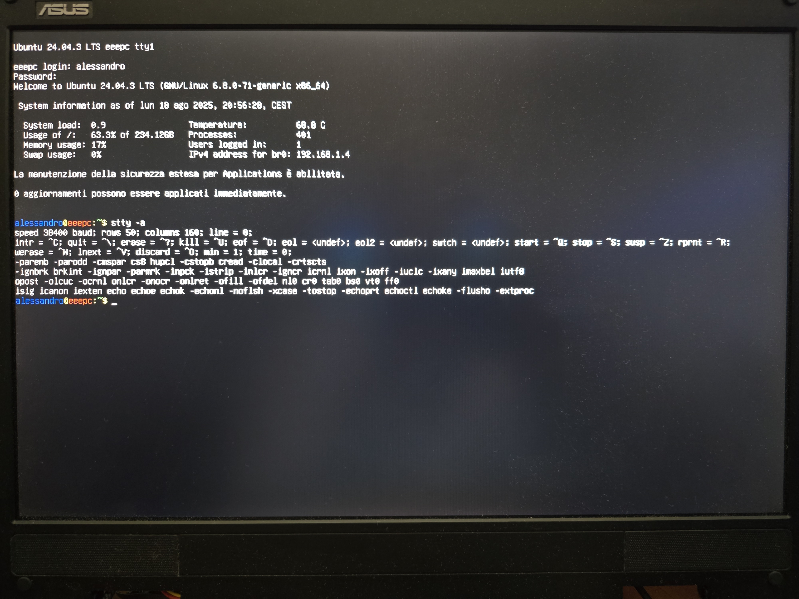

# Autostart on boot

This little guide will allow you to configure PyDashboard to run on startup on systems without a GUI (like Ubuntu Server).

!!! note
    This guide has been written after tests on both Ubuntu Server 22.04 and 24.04 with different programs, PyDashboard
    has been run only on Ubuntu Server 24.04 at the moment of writing.

!!! warning
    This guide takes for granted:
        - you have already installed and configured PyDashboard once
        - you are using Ubuntu Server 24.04 or another distro that uses `systemd`

## 1. Terminal size
First of all, we need to make sure the columns and rows of the grid are correct.

Login using one of the TTYs and run `stty -a`.



The first row of the output contains the important information, note the numbers of rows and columns.

From now, it's recommended to work via SSH, as it will be easier to copy-paste commands and text. 

## 2. Configuration file
If you plan to use the grid, open the configuration file with your favourite text editor and create an adequate number
of rows and columns so that their total heights and widths sum up to the total number of characters available.

For example:
```bash
nano ~/.config/pydasboard/config.yml
```

```yaml
grid:
  columns: [37, 7, 30, 15, 24, 16, 31]
  rows: [9, 7, 3, 7, 5, 3, 4, 6, 1, 5]
```

## 3. Systemd service
Create a new systemd unit file 

```bash
sudo nano /etc/systemd/system/pydashboard.service
```

and paste this content
!!! warning "Change USER to the actual name of the user that will run PyDashboard."

``` title="/etc/systemd/system/pydashboard.service"
[Unit]
Description=PyDashboard
After=multi-user.target 

[Service]
User=USER

PAMName=login
TTYPath=/dev/tty8
StandardInput=tty
StandardOutput=tty

UtmpIdentifier=tty8
UtmpMode=user

ExecStartPre=/usr/bin/chvt 8
ExecStartPre=-/usr/bin/dmesg -D
ExecStart=/home/USER/.local/bin/pydashboard /home/USER/.config/pydashboard/config.yml
Restart=always
RestartSec=3

[Install]
WantedBy=multi-user.target

```

Enable and start the service
```bash
sudo systemctl enable pydasboard.service
sudo systemctl start pydasboard.service
```

PyDashboard should start on the screen, if you notice some colors are wrong check [this fix](config_file.md/#color-scheme).

